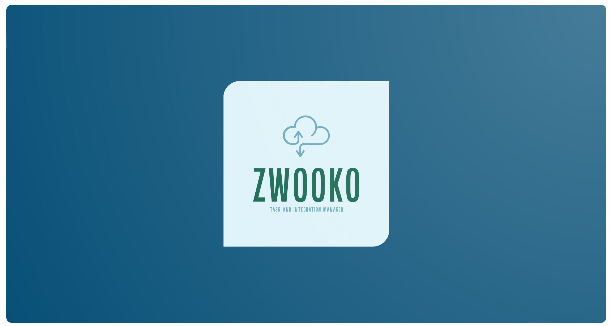

[](https://github.com/Cyberican/zwooko/actions/workflows/zwooko.yml)



# Zwooko Alpha - Zwooko Project Management

# The official Demo Website
[Zwooko Website: https://www.zwooko.com ](https://www.zwooko.com)

## This is Repository will maintain the Project Management Software.
version 0.0.1a

### Requirements
* Ubuntu Linux Distro 18.10 or higher, preferable 20.10
* PHP 7.4 or Higher

### Create the Zwooko Database Script

``` sh
$ ./setup.sh
```
## Contributors:

<table>
  <tbody>
    <tr>
      <td align="center">
        <a href="https://github.com/OMDTech">
          <br />
          <sub><b>OMDTech</b></sub>
        </a><br />
        <a href="#question-OMDTech" title="Answering Questions">💬</a>
        <a href="https://github.com/Cyberican/zwooko/commits?author=OMDTech" title="Documentation">📖</a>
        <a href="https://github.com/Cyberican/zwooko/pulls?q=is%3Apr+reviewed-by%3AOMDTech" title="Reviewed Pull Requests">👀</a>
        <a href="#talk-OMDTech" title="Talks">📢</a>
      </td>        
      <td align="center">
        <a href="https://github.com/denezt">
          <br />
          <sub><b>denezt</b></sub>
        </a><br />
        <a href="#question-denezt" title="Answering Questions">💬</a>
        <a href="https://github.com/Cyberican/zwooko/commits?author=denezt" title="Documentation">📖</a>
        <a href="https://github.com/Cyberican/zwooko/pulls?q=is%3Apr+reviewed-by%3Adenezt" title="Reviewed Pull Requests">👀</a>
        <a href="#talk-denezt" title="Talks">📢</a>
      </td>
    </tr>
  </tbody>
</table>
